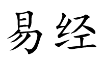
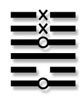
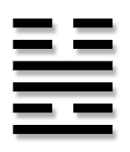
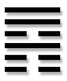
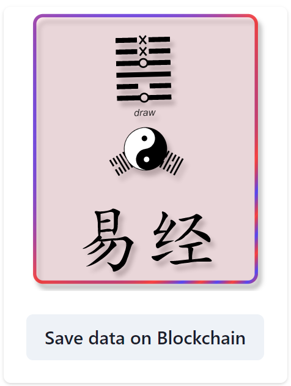

# Yi Jing 易经

A blockchain implementation with I Ching divination.

[https://en.wikipedia.org/wiki/I_Ching](https://en.wikipedia.org/wiki/I_Ching)

## Tech specifications

### Smart contracts

Development use Solidity language and Foundry

#### Random contract

Random will be used on-chain

#### Image contract

image is an animated svg and can have multiple versions

#### NFT contract

draw will be save on-chain in an NFT

* erc721
* metadata and image are **on-chain**
* image is read from previous contract
* must have a specific tokenURI to retrieve specific image version

#### Marketing contract

To share benefits with affiliated

* add/remove affiliate member
* member has address and percent retribution in basis point (bp)

## Random draw, first hexagram

By writing your name or pseudonym and a well-chosen question, we can consider the intention to be fixed. To have the
first hexagram call for Yi Jing divination, we use randomness, assuming that the random hexagram result is equal to the
yarrow-stalk method or coins method results. The randomness is on-chain, but it could be generated by the server. The
usage of on-chain VRF like Chainlink VRF is not used because it is not necessary.

### first hexagram

### from hexagram (the present, how it is now)

### to hexagram (how that could be)

## Mint the NFT

To save draw for eternity, we mint an NFT

### pseudo & question

There is no on-chain solution to encrypt data. Therefore, we can’t save an on-chain encrypted question. Your question
will be saved clearly.

