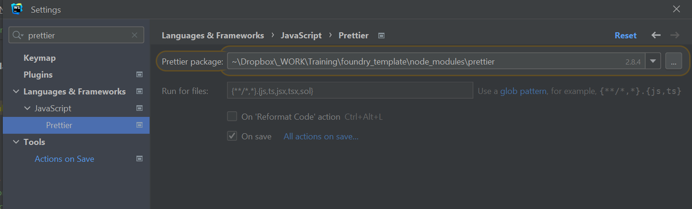

# Prettier

## on VS Code ide

## on Intellij / Webstorm ide
add `sol` in `run for files` and check `On save`, `Apply` and `Ok`

# Node modules for webstorm ide integration
Webstorm have difficulties to find an openzeppelin file to open it.

## @openzeppelin contracts example
To sync foundry openzeppelin lib version and node module version,
The slither action would fail if versions are not equals.
The code is at `.github/workflows/slither.yml:15`

you must enable Dependabot in `GitHub > Security tab`

### remapping example
`@openzeppelin/=lib/openzeppelin-contracts/`

# Slither

## Add comment to exclude next line to analysis
[https://github.com/crytic/slither/wiki/Usage#triage-mode](https://github.com/crytic/slither/wiki/Usage#triage-mode)

`// slither-disable-next-line DETECTOR_NAME`
[https://github.com/crytic/slither#detectors](https://github.com/crytic/slither#detectors)